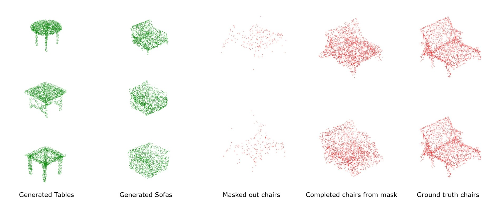
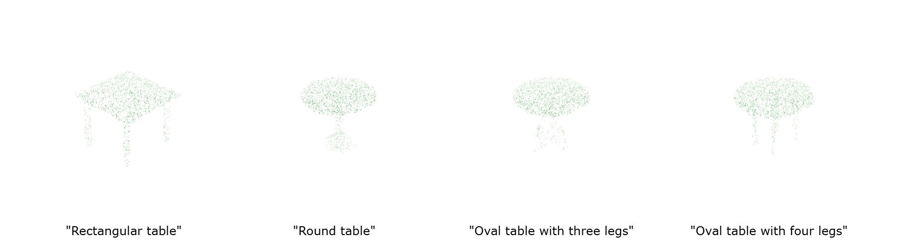
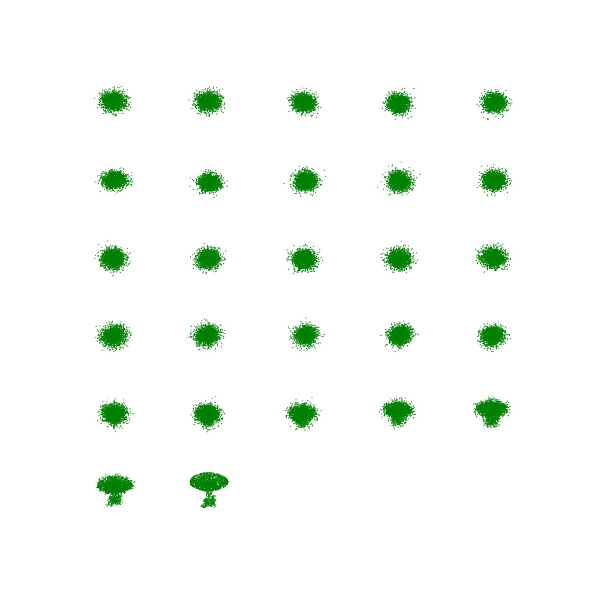

# ext Driven 3D Shape Generation and Completion Using Point-Voxel Diffusion

## Requirements:

Please use a linux based system.

### We assume these compilers are installed in your system:
- g++ (check the version: gcc --version) 
- *Note: make sure the version is compatitible with the python version.*

### Steps: 
```python 
conda create -n pvd python=3.6
```

```python 
conda activate pvd
```

```python pip3 
install torch torchvision torchaudio --index-url https://download.pytorch.org/whl/cu111
```

```python 
conda install -c conda-forge cudatoolkit-dev=11.1
```

```python 
pip install kaolin==0.1.0 xmltodict==0.12.0 numba==0.51.2 pycuda==2019.1.2 matplotlib torch-scatter==2.0.4 torch-sparse==0.6.1 torch-cluster==1.5.4 torch-spline-conv==1.2.0 descartes==1.1.0 fire==0.3.1 jupyter==1.0.0 opencv_python==4.3.0.* Shapely==1.7.0 Pillow==6.2.1 torch_geometric==1.6.0 open3d trimesh ninja transformers
```

- *If ```nvcc --version``` returns an incorrect version after installation, verify whether nvcc is installed within your Conda environment. The typical location is ```./miniconda3/envs/pvd/bin/nvcc```*

## Data

For generation, we use ShapeNet point cloud, which can be downloaded [here](https://github.com/stevenygd/PointFlow).

For completion, we use ShapeNet rendering provided by [GenRe](https://github.com/xiumingzhang/GenRe-ShapeHD).
This script `convert_cam_params.py` process the provided data.

For training the model on shape completion, we need camera parameters for each view
which are not directly available. To obtain these, simply run 
```bash
$ python convert_cam_params.py --dataroot DATA_DIR --mitsuba_xml_root XML_DIR
```
which will create `..._cam_params.npz` in each provided data folder for each view.


## Training:

```bash
$ python train_generation_text.py --category OBJECT_CATEGORY
```

Please refer to the python file for optimal training parameters.

## Testing:

- Test on validation set
```bash
$ python test_generation_text.py --category OBJECT_CATEGORY --model MODEL_PATH
```

- Test with user prompt
```bash
$ python test_generation_text.py --category OBJECT_CATEGORY --model MODEL_PATH --path_to_prompt_file PATH_TO_PROMPT_FILE
```

## Results
<div style="display: flex; flex-wrap: wrap; gap: 10px;">
  <div>
    
  </div>
</div>

<div style="display: flex; flex-wrap: wrap; gap: 50px;">
  <div>
    
  </div>
</div>

<div style="display: flex; flex-wrap: wrap; gap: 10px;">
  <div>
    
    <p style="text-align: center;">Generation process of a table</p>
  </div>
</div>

## Reference
This repository contains the implementation of PVD and ControlNet:

1. **Shape Generation and Completion Through Point-Voxel Diffusion**  
- **Authors**: Zhou, Linqi and Du, Yilun and Wu, Jiajun 
- **Published in**: Proceedings of the IEEE/CVF International Conference on Computer Vision (ICCV)
- **Github**: [link](https://github.com/alexzhou907/PVD)
- **Arxiv**: [link](https://arxiv.org/abs/2104.03670)


2. **Adding Conditional Control to Text-to-Image Diffusion Models**  
- **Authors**: Lvmin Zhang and Anyi Rao and Maneesh Agrawala
- **booktitle**: IEEE International Conference on Computer Vision (ICCV)
- **Github**: [link](https://github.com/lllyasviel/ControlNet)
- **Arxiv**: [link](https://arxiv.org/abs/2302.05543)